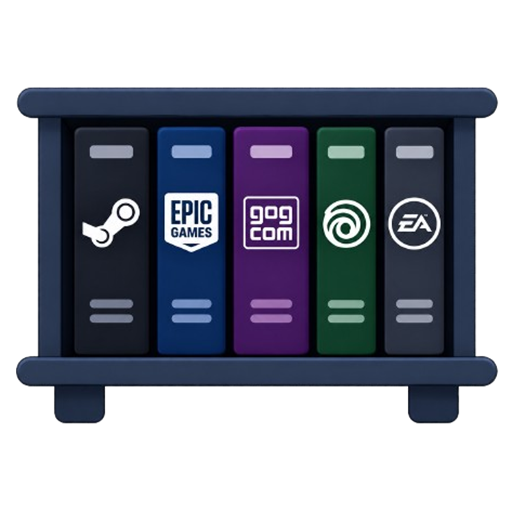
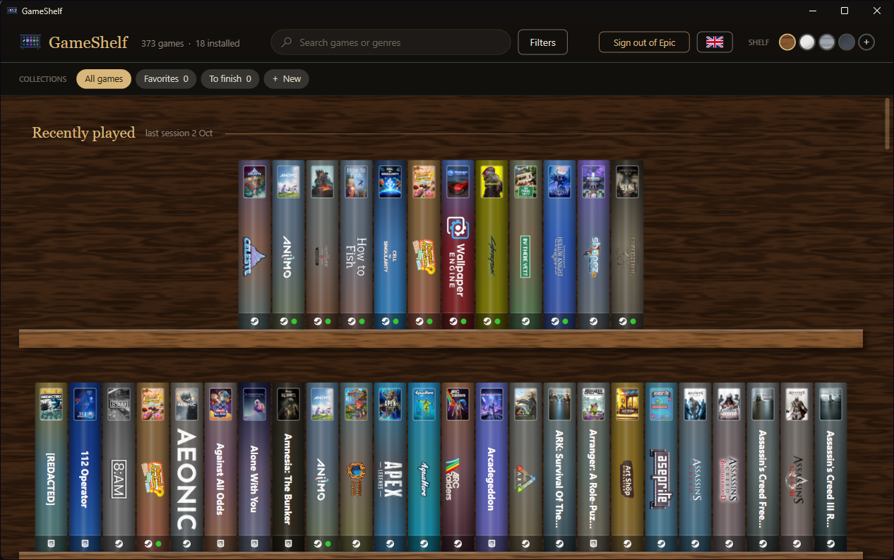
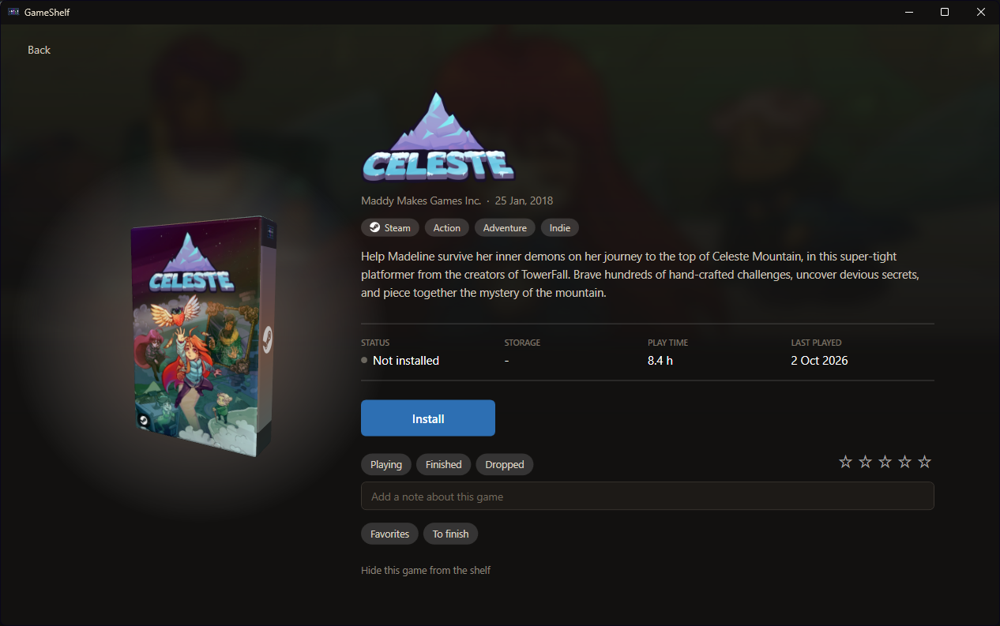

<p align="center">
  
</p>

<h1 align="center">GameShelf</h1>

<p align="center">
  A virtual bookshelf for your Steam, Epic Games and GOG library. Your games stand on a shelf like boxed games,<br>
  click one to inspect its 3D box, then play, install or uninstall it.
</p>

<p align="center">
  
</p>

> GameShelf is an unofficial, community project. It is not affiliated with or endorsed by Valve, Epic Games, GOG,
> Ubisoft, Electronic Arts, Nintendo, Sony, Sega or Microsoft. Steam, Epic Games, GOG.COM, Ubisoft, EA, Nintendo, PlayStation,
> Sega and Xbox, and their logos (shown on the icon and on the shelf to say which launcher or console a game is for), are
> trademarks of their respective owners.

## Features

- **A real shelf.** Every game is a spine: a colour gradient taken from its cover, a mini cover, and its logo.
  Spines grow slightly under the mouse and are laid out in balanced, centred rows.
- **Recently played.** A shelf at the top holds the games you played last.
- **3D box.** Click a spine to open the game's box. Drag to rotate it, scroll to zoom.
- **Game page.** Logo, description, genres, developer, install size, play time and last played date,
  over a blurred backdrop of the game's artwork.
- **Collections.** Favorites, To finish, Co-op, and your own. Drag a spine onto a collection (or use the
  toggles on the game page), click a collection to show only its games.
- **Grouped shelves.** Group the shelf by genre, status, year or collection, each group under its own title.
  In collection mode a title is a drop target: drag a game onto it to add it.
- **Your own notes.** Mark a game as Playing, Finished or Dropped, give it up to five stars and write a note.
  The status shows as a coloured dot on the spine.
- **Install and uninstall inside GameShelf.** Pick the drive and shortcuts in GameShelf's own window, watch the
  download progress (pause or cancel it), and uninstall after GameShelf's own confirmation. Steam does the work in
  the background, its install windows do not open. This needs [Steam's debug mode](#how-the-library-is-read);
  without it, install and uninstall open Steam's own windows through `steam://` links.
- **Play** through Steam.
- **Search and filters.** Search by name or genre (accents ignored, `Ctrl+F` to focus it). Filter by installed or
  not, played or never played, features (single-player, multiplayer, co-op, controller support) and genres. Sort by
  name, recently played, play time, release date, size on disk or Metacritic score. This comes from files Steam
  already keeps on your PC, so it works offline.
- **Keyboard and controller.** Arrow keys or an Xbox-style controller move between games, see
  [Keyboard and controller](#keyboard-and-controller). `F11` shows the shelf fullscreen with bigger spines,
  made for a TV.
- **Shelf skins, and your own.** Aged wood, marble, brushed metal and slate, all generated procedurally. Click
  **+** next to them to use any picture (wood, stone, fabric...) as the texture of your shelves.
- **Four languages.** English, Français, Español and Deutsch, including the game descriptions from the store.
- **Exact library, no API key.** Includes games shared by your Steam family, and leaves out refunded games
  (see [How the library is read](#how-the-library-is-read)).
- **Hide games** you do not want on the shelf.
- **Updates.** An **Updates** button lists the games that have an update waiting and starts them one by one or all
  at once. Steam's come from the app manifests on your PC (instant, no Steam client needed); GOG's from Galaxy's library file,
  by comparing the installed build with the newest one Galaxy knows (as fresh as Galaxy's last check, and its Update
  button opens the game's page in Galaxy); Epic's are read from the launcher while GameShelf controls it.
- **Add any game by hand.** The **Add a game** button takes a program, a name and a console. Give it a shortcut (.lnk, or
  drop one on the window) and its program and arguments are read from it. Give it Dolphin, PCSX2, DuckStation, RPCS3,
  PPSSPP or Cemu and it asks for the game file (ISO, ROM) and writes the command line for you. The cover is searched by name (Steam's store for PC games, libretro's box art for the consoles:
  Nintendo, PlayStation, Sega, Xbox...), taken from a picture file, dropped or pasted, or drawn from the program's
  icon. The game wears its console's logo (Wii, PlayStation, Xbox...; the Game Boys and the Nintendo 64 borrow
  Nintendo's, the Mega Drive, Saturn and Dreamcast Sega's). It starts like the others and its play time is how long the
  program stays open.
- **Platform logos.** Each spine, and the front of the 3D box, shows the logo of the launcher the game comes from.
  A game you own on several launchers (same title) is one spine with every logo; its page has a chip per launcher to
  switch between the versions (install, play and uninstall are per launcher). Your status, rating, note and
  collections are shared by all of them.
- **More than Steam.** The games of the **Epic Games Launcher** and of **GOG Galaxy** are on the shelf too, with
  their box art, and start through their launcher. See [Other launchers](#other-launchers).

<p align="center">
  
</p>

## Keyboard and controller

| Action | Keyboard | Controller |
| --- | --- | --- |
| Pick a game | Arrow keys | D-pad or left stick |
| Open the game page | `Enter` | `A` |
| Play (or install) from the game page | click | `A` |
| Close the game page | `Esc` | `B` |
| Fullscreen, bigger spines | `F11` (`Esc` leaves it) | `Y` |
| Previous / next collection | click a collection | `LB` / `RB` |
| Search | `Ctrl+F` or `/` | |

Start GameShelf with `--bigpicture` to open it fullscreen. The mouse takes over again as soon as it moves.

## Install

Download the latest `.msi` from the [Releases](../../releases) page. It installs for the current user only (no
administrator rights) and includes everything it needs, there is nothing else to install. The installer is not
code-signed, so Windows SmartScreen may ask you to confirm. A portable `.zip` is published too.

GameShelf looks for a newer release when it starts and shows an **Update** button when there is one. Updating
downloads that release's `.msi` from this repository and runs it. To turn the check off, create an empty file
named `no-update-check.txt` in `%LOCALAPPDATA%\GameShelf`.

## Build and run

Requirements: Windows 10 or 11, [Steam](https://store.steampowered.com/about/) on the same PC, and the
[.NET 8 SDK](https://dotnet.microsoft.com/download/dotnet/8.0).

```powershell
git clone https://github.com/ArthurAugis/GameShelf.git
cd GameShelf
dotnet run
```

To produce a standalone executable:

```powershell
dotnet publish GameShelf.csproj -c Release -r win-x64 --self-contained -o publish
```

## How the library is read

Steam keeps no list of what your account owns today in a file on your PC. What it does keep locally is a
*history*: installed games, played games and cached artwork. That history also contains refunded games and
games from people who left your Steam family.

GameShelf therefore has three ways to get the list, used in this order:

1. **Exact (recommended).** GameShelf asks the running Steam client for the library it displays, through
   Steam's embedded-browser debug interface. On first launch it explains this and offers to turn it on.
   Doing so creates an empty `.cef-enable-remote-debugging` file in your Steam folder and restarts Steam
   with a random local debug port (`-devtools-port`).
2. **Last known library.** The last exact list, saved on disk, used while Steam is closed.
3. **Local scan.** Built from the local history described above. It is approximate; use *Hide this game*
   to remove the extras.

### Security note about the debug mode

While Steam runs in debug mode it opens a port on `127.0.0.1` that **any program on your PC** can use to
control Steam's interface. The random port only makes it harder to find, it is not a protection. If you are
not comfortable with that, choose *Don't ask again* (GameShelf then uses options 2 and 3), or turn the mode
off at any time by deleting the `.cef-enable-remote-debugging` file from your Steam folder and restarting Steam.

### Things that may break

The exact mode, and installing without Steam's windows, rely on Steam internals that are not a public API (the
library UI objects, the install manager functions, and the `-devtools-port` option). A Steam update can break
them; GameShelf then falls back to the last known library, the local scan, and Steam's own install windows.

## Other launchers

| Launcher | What GameShelf shows | How |
| --- | --- | --- |
| Steam | Your whole library, installed or not | See above |
| Epic Games Launcher | Every game you own, installed or not (after **Epic library**), else only the installed ones | Epic's servers for the owned list, and the launcher's manifests and catalog cache (`C:\ProgramData\Epic\EpicGamesLauncher\Data`) for what is installed |
| GOG Galaxy | Every game your GOG account owns, installed or not, with play time | Galaxy's own library file (`C:\ProgramData\GOG.com\Galaxy\storage\galaxy-2.0.db`), read from a temporary copy: no sign-in and no request to GOG in GameShelf, Galaxy keeps the file up to date |

Epic keeps the list of the games you own on its servers, not on your PC, and has no public API for it. GameShelf
does what [Legendary](https://github.com/derrod/legendary) and Heroic do. The **Epic library** button shows Epic's own
sign-in page in a GameShelf window (the system's WebView2); once you are signed in, GameShelf takes the one-time code
Epic hands over and exchanges it for tokens, then reads your library and the catalog (titles, box art). Your password
never goes through GameShelf and the window's browser keeps nothing. Each time GameShelf starts, it refreshes the list
in the background, so new purchases show up on their own; the shelf is rebuilt only if the list changed.
Without WebView2, GameShelf opens the sign-in page in your browser and asks you to paste the code Epic shows. Without
signing in, only the games installed on this PC are shown.

**What is stored.** The list of your games in `epic-library.json`, and one Epic *refresh token* in `epic-auth.bin`,
encrypted with Windows' DPAPI for your Windows account (another account, or the file copied to another PC, cannot
read it). It is never logged or shown, and only ever sent to Epic. It is what lets GameShelf refresh the list without
asking you to sign in again, and it gives access to your Epic account to any program running as you, so treat the
`GameShelf` folder like a saved password. The **Sign out of Epic** button deletes the token and the list. If you do
not open GameShelf for a few weeks, Epic expires the token and you sign in again.

This relies on Epic's launcher endpoints, which are not a public API, so Epic can change them.

Epic games start through the launcher. *Install*, *Pause* and *Cancel* on a game's page drive the Epic Games
Launcher from GameShelf, without opening its window (it is kept minimized in the task bar, and brought back there if it
was closed to the notification area), like for Steam. *Uninstall* does not use the launcher, whose confirmation box
cannot be answered from outside: GameShelf deletes the game's folder (only if it holds the launcher's `.egstore` data) and
its manifest, then closes the launcher so it forgets the game. GameShelf restarts the launcher once with a local
debug port (`-cefdebug=<random port>`, asked first), and calls the same functions the launcher's own store page calls
(`ue.productinfo`). The launcher does the downloading, so it installs into its default folder (change it in the
launcher's settings), and updates and cloud saves keep working. The same security note as for Steam applies: while the
launcher runs with its debug port, any program on your PC can use that port; restart the launcher normally to turn it
off. It also relies on the launcher's internals, so an update of the launcher can break it, and GameShelf then
falls back to opening the launcher's own install window. The launcher reports no download speed, only a percentage.
Play time is only known for Steam games, so the played / never played filters are about Steam.

**GOG Galaxy.** Sign in to Galaxy once and its library appears on the shelf by itself (games of other platforms
linked in Galaxy are left out: Steam and Epic are read directly). *Play* starts the game through Galaxy
(`GalaxyClient.exe /command=runGame`), *Install* opens the game's page in Galaxy, and *Uninstall* runs the game's own
uninstaller. Galaxy has no way to be driven from outside, so GameShelf shows no download progress for GOG games. The
cover comes from GOG's image server.

To add another launcher, write a reader that returns `Game` objects (see [Launchers/EpicLibrary.cs](Launchers/EpicLibrary.cs)),
give them an id made up from a stable name, and add the launcher to the `Launcher` enum.

## Data on your PC

GameShelf only reads Steam's files. It writes here, in `%LOCALAPPDATA%\GameShelf`:

| File | Content |
| --- | --- |
| `library.json` | Last exact library |
| `covers\` | Covers, logos and backdrops downloaded from Steam's CDN |
| `details\` | Store descriptions and genres, one file per game (and per language) |
| `collections.json` | Your collections and the games in them |
| `notes.json` | Your status, rating and note for each game |
| `skins\` | Shelf textures you imported, one folder each |
| `hidden.txt` | Games you hid |
| `skin.txt` | Selected shelf skin |
| `language.txt` | Chosen language |
| `window.json` | Position and size of the main window, and whether it was maximized |
| `port.txt` | Random debug port |
| `no-prompt.txt` | Present if you chose *Don't ask again* |
| `no-update-check.txt` | Create it to turn off the check for new releases |
| `install-folder.txt` | Last folder you installed to |
| `epic-library.json` | Your Epic games, as last read |
| `manual-games.json` | The games you added by hand (program, arguments, console, play time); their covers are in `covers` |
| `epic-auth.bin` | Epic refresh token, encrypted for your Windows account |

The network access is public, without any API key: Steam's servers for missing covers, logos and backdrops, and for
the description, genres, developer, and release date of a game (the public store API), Epic's servers for
the box art of Epic games, libretro's thumbnail server for the covers of consoles' games, GOG's image server for the covers of GOG games, and GitHub's public API to look for a new release of GameShelf. The only sign-in is the
Epic one (see above), and you can sign out of it at any time.

### Shelf textures

To import a texture, click **+** next to the skins in the header and choose a picture. GameShelf keeps a copy
in `skins\<name>\plank.png`. Put a second picture named `wall.png` in the same folder to give the wall behind
the shelves a texture of its own; without it the wall is the plank texture, darkened. Right-click a skin you
imported to delete it.

## Project layout

```
Assets/        App icon and logo (logo-source.png is the original artwork)
Launchers/     Readers for the launchers other than Steam (Epic Games Launcher, GOG Galaxy)
Controls/      SpineView (a game on the shelf), GameBoxView and BoxTextures (the 3D box), SearchBox,
               FilterPanel, SpeedGraph (download speed chart)
Localization/  One JSON file per language: English text to translated text
Models/        Game, GameDetails, install models
Services/      Per-user storage, collections, notes, hidden games, cover and logo download, store details and
               search / filter / grouping logic, translations, controller input, updates
Steam/         Steam locator and library scan, VDF parsers, metadata (genres, play time), debug interface
               (library, installer), Steam process and window control
Theming/       Shelf skins, procedural textures, colour helpers, button styles, dark title bar
Views/         Main window, game page, and the dialogs (install, exact mode, message, input, Epic sign-in),
               which open over the main window through DialogHost instead of in windows of their own
installer/     WiX definition of the Windows installer
tests/         Unit tests (xUnit)
docs/          Screenshots
```

## Languages

The UI text is in English in the code and in the XAML; the translations are in `Localization\<code>.json`, a flat
object whose keys are the English texts. To add a language, copy `fr.json` to `<code>.json`, translate the
values (keep the `{0}`, `{1}` placeholders), and add one line to `Loc.Languages` in
[Services/Loc.cs](Services/Loc.cs). A test checks that every language has every text and the same placeholders,
and that every text written in the code has a translation. `--lang fr` on the command line forces a language for
one run.

## Tests and continuous integration

```powershell
dotnet test
```

The tests cover the VDF parsers, the Steam library scan (against a made-up Steam folder), the search, filters and
grouping, the translations and the update check. On every push, GitHub Actions builds with warnings treated as
errors and runs the tests ([.github/workflows/ci.yml](.github/workflows/ci.yml)).

## Making a release

1. Set `RepositoryUrl` in [GameShelf.csproj](GameShelf.csproj) to your repository, so the app can look for updates.
2. Push a tag: `git tag v1.2.3` then `git push origin v1.2.3`.

[The release workflow](.github/workflows/release.yml) builds and tests, then publishes a GitHub release with the
installer (`GameShelf-1.2.3-win-x64.msi`) and a portable zip. The tag becomes the version of the app.

## Status

Version 0.2.0. Developed and tested on Windows 11 with the Steam client in French and English.
Pausing and cancelling a download was tested on one small Steam game. The controller code is
written for Xbox-style (XInput) controllers.

## Contributing

Issues and pull requests are welcome. Please keep the code commented in English and add UI text in English
(with its translations in `Localization`). `dotnet build` must finish with no warning: the project enables the
.NET code analyzers and the rules in [.editorconfig](.editorconfig).

## License

[MIT](LICENSE)
